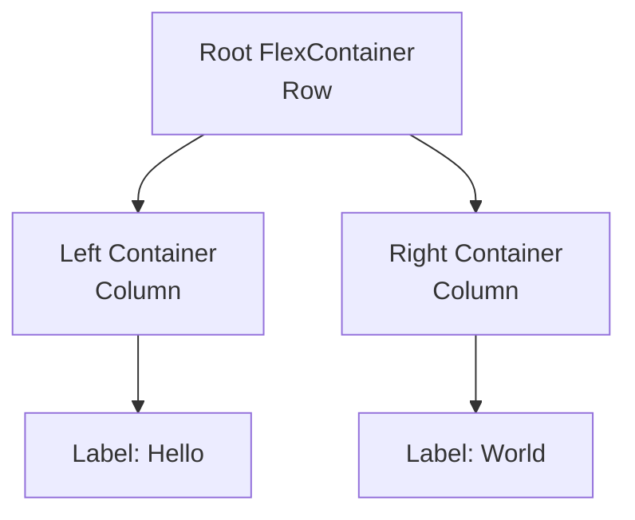
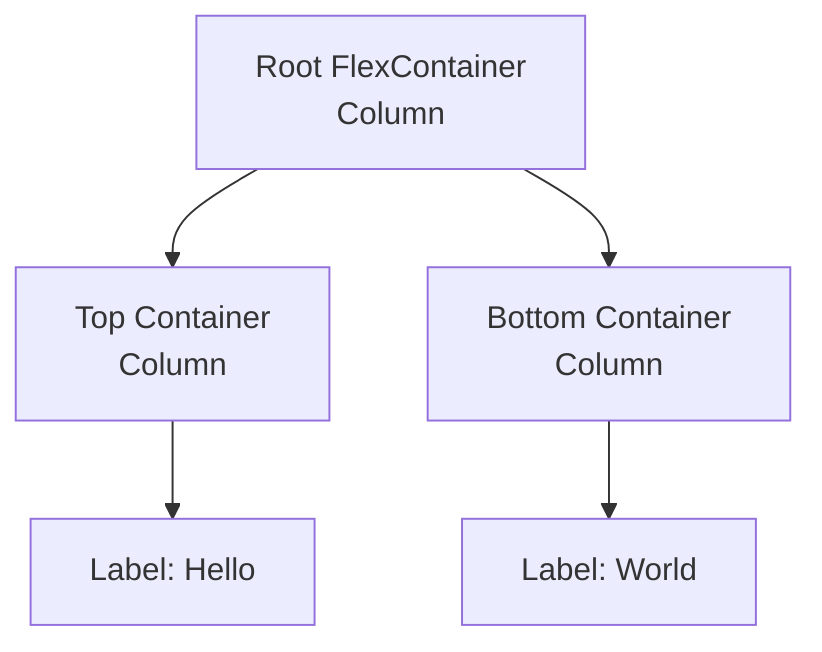
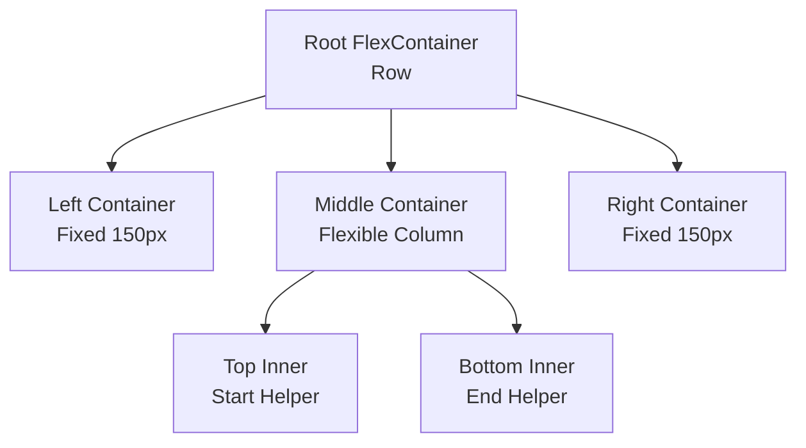

# Mashup Creation Recipes

This document collects proven recipes for programmatically creating ThingWorx Mashups. These recipes are designed to be used by agents or developers to quickly generate correct Mashup structures.

## Recipe 1: Two-Column Responsive Layout

This recipe creates a responsive Mashup with two side-by-side columns, each containing a centered label.

### Purpose
*   Demonstrates correct nesting of `flexcontainer` widgets.
*   Shows how to use `flex-direction: row` vs `column`.
*   Uses modern `ptcslabel` widgets.

### Structure


### Key JSON Properties

#### 1. Root Container
The root container holds the two columns. It uses `row` direction to place them side-by-side.
```javascript
{
    "Properties": {
        "Type": "flexcontainer",
        "flex-direction": "row", // Horizontal layout
        "align-items": "center",
        "justify-content": "space-around", // Space out columns
        "flex-grow": 1,
        "ResponsiveLayout": true
    },
    "Widgets": [ ... ]
}
```

#### 2. Child Containers (Columns)
Each child container holds content (ex. a label). It uses `column` direction (default vertical stacking) and centers its content.
```javascript
{
    "Properties": {
        "Type": "flexcontainer",
        "flex-direction": "column",
        "align-items": "center",
        "justify-content": "center", // Center content vertically
        "flex-grow": 1, // fill available space
        "ResponsiveLayout": true
    },
    "Widgets": [ ... ]
}
```

### Full Creation Script Template

Use this script as a template to create this layout. Remember to update `MASHUP_NAME`.

```javascript
const fs = require('fs');
const path = require('path');

// Load config
const envPath = path.join(__dirname, '.env.example');
const envContent = fs.readFileSync(envPath, 'utf8');
const config = {};
envContent.split('\n').forEach(line => {
    const [key, value] = line.split('=');
    if (key && value) config[key.trim()] = value.trim();
});

const BASE_URL = config.THINGWORX_BASE_URL;
const APP_KEY = config.THINGWORX_APP_KEY;
const MASHUP_NAME = "antigravity.hello-world-mu"; // CHANGE THIS NAME

async function createMashup() {
    console.log(`Creating Mashup: ${MASHUP_NAME}...`);

    const mashupContent = {
        "UI": {
            "Properties": {
                "Id": "mashup-root",
                "Type": "mashup",
                "ResponsiveLayout": true,
                "Width": 1024,
                "Height": 618,
                "Style": "DefaultMashupStyle",
                "StyleTheme": "PTC Convergence Theme",
                "Title": "Hello World Mashup",
                "Area": "Mashup",
                "__TypeDisplayName": "Mashup",
                "Visible": true,
                "Z-index": 10,
                "Top": 0,
                "Left": 0
            },
            "Widgets": [
                {
                    "Properties": {
                        "Type": "flexcontainer",
                        "__TypeDisplayName": "Responsive Container",
                        "Id": "flexcontainer-root",
                        "DisplayName": "root-container",
                        "flex-direction": "row",
                        "align-items": "center",
                        "justify-content": "space-around",
                        "flex-grow": 1,
                        "ResponsiveLayout": true,
                        "LastContainer": true
                    },
                    "Widgets": [
                        // Container 1 (Left)
                        {
                            "Properties": {
                                "Type": "flexcontainer",
                                "__TypeDisplayName": "Responsive Container",
                                "Id": "flexcontainer-1",
                                "DisplayName": "container-hello",
                                "flex-direction": "column",
                                "align-items": "center",
                                "justify-content": "center",
                                "flex-grow": 1,
                                "ResponsiveLayout": true
                            },
                            "Widgets": [
                                {
                                    "Properties": {
                                        "Type": "ptcslabel",
                                        "__TypeDisplayName": "Label",
                                        "Id": "ptcslabel-hello",
                                        "DisplayName": "lblHello",
                                        "LabelText": "Hello",
                                        "HorizontalAlignment": "left",
                                        "VerticalAlignment": "flex-start",
                                        "UseTheme": true,
                                        "Visible": true
                                    },
                                    "Widgets": []
                                }
                            ]
                        },
                        // Container 2 (Right)
                        {
                            "Properties": {
                                "Type": "flexcontainer",
                                "__TypeDisplayName": "Responsive Container",
                                "Id": "flexcontainer-2",
                                "DisplayName": "container-world",
                                "flex-direction": "column",
                                "align-items": "center",
                                "justify-content": "center",
                                "flex-grow": 1,
                                "ResponsiveLayout": true
                            },
                            "Widgets": [
                                {
                                    "Properties": {
                                        "Type": "ptcslabel",
                                        "__TypeDisplayName": "Label",
                                        "Id": "ptcslabel-world",
                                        "DisplayName": "lblWorld",
                                        "LabelText": "World",
                                        "HorizontalAlignment": "left",
                                        "VerticalAlignment": "flex-start",
                                        "UseTheme": true,
                                        "Visible": true
                                    },
                                    "Widgets": []
                                }
                            ]
                        }
                    ]
                }
            ]
        },
        "Data": {
            "Session": {
                "DataName": "Session",
                "EntityName": "",
                "EntityType": "Session",
                "Id": "session",
                "Services": [{
                    "Id": "SessionInterface",
                    "Name": "GetGlobalSessionValues",
                    "Characteristic": "Services",
                    "Target": "GetGlobalSessionValues",
                    "APIMethod": "post",
                    "RefreshInterval": 0,
                    "Parameters": {}
                }]
            },
            "UserExtensions": {
                "DataName": "UserExtensions",
                "EntityName": "",
                "EntityType": "UserExtensions",
                "Id": "UserExtensions",
                "Services": [{
                    "Id": "UserExtensionInterface",
                    "Name": "GetCurrentUserExtensionProperties",
                    "Characteristic": "Services",
                    "Target": "GetCurrentUserExtensionProperties",
                    "APIMethod": "post",
                    "RefreshInterval": 0,
                    "Parameters": {}
                }]
            }
        },
        "Events": [],
        "DataBindings": [],
        "mashupType": "mashup"
    };

    // Construct Payload
    const payload = {
        "entityType": "Mashups",
        "name": MASHUP_NAME,
        "description": "Recipe Created Mashup",
        "configurationTables": {
            "MobileSettings": {
                "name": "MobileSettings",
                "isHidden": true,
                "dataShape": {
                     "fieldDefinitions": {
                        "initialScale": { "baseType": "NUMBER", "name": "initialScale", "aspects": { "defaultValue": 1 } },
                        "width": { "baseType": "STRING", "name": "width", "aspects": { "defaultValue": "device-width" } },
                        "height": { "baseType": "STRING", "name": "height", "aspects": { "defaultValue": "device-height" } },
                        "minimumScale": { "baseType": "NUMBER", "name": "minimumScale", "aspects": { "defaultValue": 0.1 } },
                        "maximumScale": { "baseType": "NUMBER", "name": "maximumScale", "aspects": { "defaultValue": 10 } },
                        "disableZoom": { "baseType": "BOOLEAN", "name": "disableZoom", "aspects": { "defaultValue": false } },
                        "fullScreenMode": { "baseType": "BOOLEAN", "name": "fullScreenMode", "aspects": { "defaultValue": true } },
                        "iosStatusBarAppearance": { "baseType": "STRING", "name": "iosStatusBarAppearance", "aspects": { "defaultValue": "default" } },
                        "iosShortcutIconTitle": { "baseType": "STRING", "name": "iosShortcutIconTitle", "aspects": { "defaultValue": "" } }
                    }
                },
                "rows": [{
                    "initialScale": 1,
                    "width": "device-width",
                    "height": "device-height",
                    "minimumScale": 0.1,
                    "maximumScale": 10,
                    "disableZoom": false,
                    "fullScreenMode": true,
                    "iosStatusBarAppearance": "black-translucent",
                    "iosShortcutIconTitle": ""
                }]
            }
        },
        "aspects": {
            "mashupType": "mashup",
            "isResponsive": true,
            "isFlex": true
        },
        "mashupContent": JSON.stringify(mashupContent),
        "projectName": "PTCDefaultProject"
    };

    // Send Request
    const url = `${BASE_URL}/Mashups?Content-Type=application%2Fjson&reason=created%20by%20Antigravity`;
    const response = await fetch(url, {
        method: 'PUT',
        headers: {
            'appKey': APP_KEY,
            'Content-Type': 'application/json',
            'Accept': 'application/json'
        },
        body: JSON.stringify(payload)
    });

    if (!response.ok) {
        const text = await response.text();
        console.error(`Failed to create mashup: ${response.status} ${response.statusText}`);
        console.error(text);
    } else {
        console.log(`✓ Mashup '${MASHUP_NAME}' created successfully!`);
        console.log(`  View it at: ${BASE_URL}/Mashups/${MASHUP_NAME}`);
    }
}

createMashup();
```

## Recipe 2: Vertical Stacked Layout

This recipe creates a responsive Mashup with two stacked containers (one above the other), each containing a centered label.

### Purpose
*   Demonstrates vertical stacking using `flex-direction: column` on the root.
*   Shows how to structure simple dashboard-like vertical sections.

### Structure


### Key JSON Properties

#### 1. Root Container
The root container uses `column` direction to stack children vertically.
```javascript
{
    "Properties": {
        "Type": "flexcontainer",
        "flex-direction": "column", // Vertical layout
        "align-items": "center",
        "justify-content": "center",
        "flex-grow": 1,
        "ResponsiveLayout": true
    },
    "Widgets": [ ... ]
}
```

### Full Creation Script Template

Use this script as a template to create this layout. Remember to update `MASHUP_NAME`.

```javascript
const fs = require('fs');
const path = require('path');

// Load config
const envPath = path.join(__dirname, '.env.example');
const envContent = fs.readFileSync(envPath, 'utf8');
const config = {};
envContent.split('\n').forEach(line => {
    const [key, value] = line.split('=');
    if (key && value) config[key.trim()] = value.trim();
});

const BASE_URL = config.THINGWORX_BASE_URL;
const APP_KEY = config.THINGWORX_APP_KEY;
const MASHUP_NAME = "antigravity.hello-world-vertical-mu"; // CHANGE THIS NAME

async function createMashup() {
    console.log(`Creating Mashup: ${MASHUP_NAME}...`);

    const mashupContent = {
        "UI": {
            "Properties": {
                "Id": "mashup-root",
                "Type": "mashup",
                "ResponsiveLayout": true,
                "Width": 1024,
                "Height": 618,
                "Style": "DefaultMashupStyle",
                "StyleTheme": "PTC Convergence Theme",
                "Title": "Hello World Vertical Mashup",
                "Area": "Mashup",
                "__TypeDisplayName": "Mashup",
                "Visible": true,
                "Z-index": 10,
                "Top": 0,
                "Left": 0
            },
            "Widgets": [
                {
                    "Properties": {
                        "Type": "flexcontainer",
                        "__TypeDisplayName": "Responsive Container",
                        "Id": "flexcontainer-root",
                        "DisplayName": "root-container",
                        "flex-direction": "column", // Vertical Stacking
                        "align-items": "center",
                        "justify-content": "center",
                        "flex-grow": 1,
                        "ResponsiveLayout": true,
                        "LastContainer": true
                    },
                    "Widgets": [
                        // Container 1 (Top)
                        {
                            "Properties": {
                                "Type": "flexcontainer",
                                "__TypeDisplayName": "Responsive Container",
                                "Id": "flexcontainer-top",
                                "DisplayName": "container-hello",
                                "flex-direction": "column",
                                "align-items": "center",
                                "justify-content": "center",
                                "flex-grow": 1,
                                "ResponsiveLayout": true
                            },
                            "Widgets": [
                                {
                                    "Properties": {
                                        "Type": "ptcslabel",
                                        "__TypeDisplayName": "Label",
                                        "Id": "ptcslabel-hello",
                                        "DisplayName": "lblHello",
                                        "LabelText": "Hello",
                                        "HorizontalAlignment": "left",
                                        "VerticalAlignment": "flex-start",
                                        "UseTheme": true,
                                        "Visible": true
                                    },
                                    "Widgets": []
                                }
                            ]
                        },
                        // Container 2 (Bottom)
                        {
                            "Properties": {
                                "Type": "flexcontainer",
                                "__TypeDisplayName": "Responsive Container",
                                "Id": "flexcontainer-bottom",
                                "DisplayName": "container-world",
                                "flex-direction": "column",
                                "align-items": "center",
                                "justify-content": "center",
                                "flex-grow": 1,
                                "ResponsiveLayout": true
                            },
                            "Widgets": [
                                {
                                    "Properties": {
                                        "Type": "ptcslabel",
                                        "__TypeDisplayName": "Label",
                                        "Id": "ptcslabel-world",
                                        "DisplayName": "lblWorld",
                                        "LabelText": "World",
                                        "HorizontalAlignment": "left",
                                        "VerticalAlignment": "flex-start",
                                        "UseTheme": true,
                                        "Visible": true
                                    },
                                    "Widgets": []
                                }
                            ]
                        }
                    ]
                }
            ]
        },
        "Data": {
            "Session": {
                "DataName": "Session",
                "EntityName": "",
                "EntityType": "Session",
                "Id": "session",
                "Services": [{
                    "Id": "SessionInterface",
                    "Name": "GetGlobalSessionValues",
                    "Characteristic": "Services",
                    "Target": "GetGlobalSessionValues",
                    "APIMethod": "post",
                    "RefreshInterval": 0,
                    "Parameters": {}
                }]
            },
            "UserExtensions": {
                "DataName": "UserExtensions",
                "EntityName": "",
                "EntityType": "UserExtensions",
                "Id": "UserExtensions",
                "Services": [{
                    "Id": "UserExtensionInterface",
                    "Name": "GetCurrentUserExtensionProperties",
                    "Characteristic": "Services",
                    "Target": "GetCurrentUserExtensionProperties",
                    "APIMethod": "post",
                    "RefreshInterval": 0,
                    "Parameters": {}
                }]
            }
        },
        "Events": [],
        "DataBindings": [],
        "mashupType": "mashup"
    };

    const payload = {
        "entityType": "Mashups",
        "name": MASHUP_NAME,
        "description": "Hello World Vertical Mashup",
        "configurationTables": {
            "MobileSettings": {
                "name": "MobileSettings",
                "isHidden": true,
                "dataShape": {
                     "fieldDefinitions": {
                        "initialScale": { "baseType": "NUMBER", "name": "initialScale", "aspects": { "defaultValue": 1 } },
                        "width": { "baseType": "STRING", "name": "width", "aspects": { "defaultValue": "device-width" } },
                        "height": { "baseType": "STRING", "name": "height", "aspects": { "defaultValue": "device-height" } },
                        "minimumScale": { "baseType": "NUMBER", "name": "minimumScale", "aspects": { "defaultValue": 0.1 } },
                        "maximumScale": { "baseType": "NUMBER", "name": "maximumScale", "aspects": { "defaultValue": 10 } },
                        "disableZoom": { "baseType": "BOOLEAN", "name": "disableZoom", "aspects": { "defaultValue": false } },
                        "fullScreenMode": { "baseType": "BOOLEAN", "name": "fullScreenMode", "aspects": { "defaultValue": true } },
                        "iosStatusBarAppearance": { "baseType": "STRING", "name": "iosStatusBarAppearance", "aspects": { "defaultValue": "default" } },
                        "iosShortcutIconTitle": { "baseType": "STRING", "name": "iosShortcutIconTitle", "aspects": { "defaultValue": "" } }
                    }
                },
                "rows": [{
                    "initialScale": 1,
                    "width": "device-width",
                    "height": "device-height",
                    "minimumScale": 0.1,
                    "maximumScale": 10,
                    "disableZoom": false,
                    "fullScreenMode": true,
                    "iosStatusBarAppearance": "black-translucent",
                    "iosShortcutIconTitle": ""
                }]
            }
        },
        "aspects": {
            "mashupType": "mashup",
            "isResponsive": true,
            "isFlex": true
        },
        "mashupContent": JSON.stringify(mashupContent),
        "projectName": "PTCDefaultProject"
    };

    const url = `${BASE_URL}/Mashups?Content-Type=application%2Fjson&reason=created%20by%20Antigravity`;

    const response = await fetch(url, {
        method: 'PUT',
        headers: {
            'appKey': APP_KEY,
            'Content-Type': 'application/json',
            'Accept': 'application/json'
        },
        body: JSON.stringify(payload)
    });

    if (!response.ok) {
        const text = await response.text();
        console.error(`Failed to create mashup: ${response.status} ${response.statusText}`);
        console.error(text);
    } else {
        console.log(`✓ Mashup '${MASHUP_NAME}' created successfully!`);
        console.log(`  View it at: ${BASE_URL}/Mashups/${MASHUP_NAME}`);
    }
}

createMashup();
```

## Recipe 3: Complex Fixed Sidebar Layout

This recipe demonstrates a more advanced layout commonly used for applications: A main workspace flanked by fixed-width static sidebars (e.g., for navigation or tool panels).

### Purpose
*   **Mixing Static & Responsive**: Shows how to keep sidebars fixed while the center content grows.
*   **Strict Flex Sizing**: Demonstrates the use of explicit `flex-min-width` and `flex-max-width` to force containers to adhere to specific pixel dimensions.
*   **Empty Static Containers**: Shows configuration for structural containers that may be populated dynamically at runtime or used for spacing.

### Structure


### Key JSON Properties

#### 1. Fixed Sidebar Containers
To force a container to be exactly 150px wide and **never** resize, you must use a combination of standard properties and strict flex properties.

**Critical Properties**:
*   `ResponsiveLayout`: `false` (Treats internal layout as static canvas, good for fixed tools).
*   `flex-grow`: `0` (Do not grow).
*   `flex-shrink`: `0` (Do not shrink).
*   `flex-basis`: `"150px"` (Initial size).
*   `flex-min-width`: `"150px"` (Hard floor).
*   `flex-max-width`: `"150px"` (Hard ceiling).

```javascript
{
    "Properties": {
        "Type": "flexcontainer",
        "Id": "flexcontainer-left",
        "DisplayName": "FixedSidebar",
        "ResponsiveLayout": false, // Static internal
        "Width": 150,
        "MinWidth": 150,
        "MaxWidth": 150,
        // STRICT FLEX LOCKING
        "flex-grow": 0,
        "flex-shrink": 0,
        "flex-basis": "150px",
        "flex-min-width": "150px",
        "flex-max-width": "150px"
    },
    "Widgets": []
}
```

### Full Creation Script Template

Use this script to generate the complex layout.

```javascript
const fs = require('fs');
const path = require('path');

// Load config
const envPath = path.join(__dirname, '.env.example');
const envContent = fs.readFileSync(envPath, 'utf8');
const config = {};
envContent.split('\n').forEach(line => {
    const [key, value] = line.split('=');
    if (key && value) config[key.trim()] = value.trim();
});

const BASE_URL = config.THINGWORX_BASE_URL;
const APP_KEY = config.THINGWORX_APP_KEY;
const MASHUP_NAME = "antigravity.complex-layout-mu"; // CHANGE THIS NAME

async function createMashup() {
    console.log(`Creating Mashup: ${MASHUP_NAME}...`);

    const mashupContent = {
        "UI": {
            "Properties": {
                "Id": "mashup-root",
                "Type": "mashup",
                "ResponsiveLayout": true,
                "Width": 1024,
                "Height": 618,
                "Style": "DefaultMashupStyle",
                "StyleTheme": "PTC Convergence Theme",
                "Title": "Complex Layout Mashup",
                "Area": "Mashup",
                "__TypeDisplayName": "Mashup",
                "Visible": true,
                "Z-index": 10,
                "Top": 0,
                "Left": 0
            },
            "Widgets": [
                {
                    "Properties": {
                        "Type": "flexcontainer",
                        "__TypeDisplayName": "Responsive Container",
                        "Id": "flexcontainer-root",
                        "DisplayName": "root-row",
                        "flex-direction": "row", // Horizontal main layout
                        "align-items": "stretch",
                        "justify-content": "flex-start",
                        "flex-grow": 1,
                        "ResponsiveLayout": true,
                        "LastContainer": true
                    },
                    "Widgets": [
                        // 1. LEFT CONTAINER (Fixed 150px, Static)
                        {
                            "Properties": {
                                "Type": "flexcontainer",
                                "__TypeDisplayName": "Responsive Container",
                                "Id": "flexcontainer-left",
                                "DisplayName": "container-left-fixed",
                                // "Static" internal behavior
                                "ResponsiveLayout": false,
                                "Width": 150,
                                "MinWidth": 150,
                                "MaxWidth": 150,
                                // Strict Flex Fixed sizing
                                "flex-grow": 0,
                                "flex-shrink": 0,
                                "flex-basis": "150px",
                                "flex-min-width": "150px",
                                "flex-max-width": "150px",
                                "Style": "DefaultContainerStyle"
                            },
                            "Widgets": [] // Empty as requested
                        },
                        // 2. MIDDLE CONTAINER (Flexible, Vertical Stack)
                        {
                            "Properties": {
                                "Type": "flexcontainer",
                                "__TypeDisplayName": "Responsive Container",
                                "Id": "flexcontainer-middle",
                                "DisplayName": "container-middle-flex",
                                "flex-direction": "column", // Vertical stack inside
                                "align-items": "stretch",
                                "justify-content": "flex-start",
                                "flex-grow": 1, // Take remaining space
                                "ResponsiveLayout": true
                            },
                            "Widgets": [
                                // Top Inner (Hello)
                                {
                                    "Properties": {
                                        "Type": "flexcontainer",
                                        "Id": "flexcontainer-mid-top",
                                        "DisplayName": "container-hello",
                                        "flex-direction": "column",
                                        "align-items": "center",
                                        "justify-content": "center",
                                        "flex-grow": 1,
                                        "ResponsiveLayout": true
                                    },
                                    "Widgets": [
                                        {
                                            "Properties": {
                                                "Type": "ptcslabel",
                                                "Id": "ptcslabel-hello",
                                                "LabelText": "Hello",
                                                "Visible": true
                                            },
                                            "Widgets": []
                                        }
                                    ]
                                },
                                // Bottom Inner (World)
                                {
                                    "Properties": {
                                        "Type": "flexcontainer",
                                        "Id": "flexcontainer-mid-bottom",
                                        "DisplayName": "container-world",
                                        "flex-direction": "column",
                                        "align-items": "center",
                                        "justify-content": "center",
                                        "flex-grow": 1,
                                        "ResponsiveLayout": true
                                    },
                                    "Widgets": [
                                        {
                                            "Properties": {
                                                "Type": "ptcslabel",
                                                "Id": "ptcslabel-world",
                                                "LabelText": "World",
                                                "Visible": true
                                            },
                                            "Widgets": []
                                        }
                                    ]
                                }
                            ]
                        },
                        // 3. RIGHT CONTAINER (Fixed 150px, Static)
                        {
                            "Properties": {
                                "Type": "flexcontainer",
                                "__TypeDisplayName": "Responsive Container",
                                "Id": "flexcontainer-right",
                                "DisplayName": "container-right-fixed",
                                // "Static" internal behavior
                                "ResponsiveLayout": false,
                                "Width": 150,
                                "MinWidth": 150,
                                "MaxWidth": 150,
                                // Strict Flex Fixed sizing
                                "flex-grow": 0,
                                "flex-shrink": 0,
                                "flex-basis": "150px",
                                "flex-min-width": "150px",
                                "flex-max-width": "150px",
                                "Style": "DefaultContainerStyle"
                            },
                            "Widgets": [] // Empty as requested
                        }
                    ]
                }
            ]
        },
        "Data": {
            "Session": {
                "DataName": "Session",
                "EntityName": "",
                "EntityType": "Session",
                "Id": "session",
                "Services": [{
                    "Id": "SessionInterface",
                    "Name": "GetGlobalSessionValues",
                    "Characteristic": "Services",
                    "Target": "GetGlobalSessionValues",
                    "APIMethod": "post",
                    "RefreshInterval": 0,
                    "Parameters": {}
                }]
            },
            "UserExtensions": {
                "DataName": "UserExtensions",
                "EntityName": "",
                "EntityType": "UserExtensions",
                "Id": "UserExtensions",
                "Services": [{
                    "Id": "UserExtensionInterface",
                    "Name": "GetCurrentUserExtensionProperties",
                    "Characteristic": "Services",
                    "Target": "GetCurrentUserExtensionProperties",
                    "APIMethod": "post",
                    "RefreshInterval": 0,
                    "Parameters": {}
                }]
            }
        },
        "Events": [],
        "DataBindings": [],
        "mashupType": "mashup"
    };

    // DELETE existing mashup first to avoid 409
    try {
        console.log(`Deleting existing Mashup (if any): ${MASHUP_NAME}...`);
        await fetch(`${BASE_URL}/Mashups/${MASHUP_NAME}`, {
            method: 'DELETE',
            headers: {
                'appKey': APP_KEY,
                'Content-Type': 'application/json',
                'Accept': 'application/json'
            }
        });
    } catch (e) {
        // Ignore delete errors
    }

    const payload = {
        "entityType": "Mashups",
        "name": MASHUP_NAME,
        "description": "Complex Layout Mashup (Left/Right Fixed Static 150px, Center Split)",
        "configurationTables": {
            "MobileSettings": {
                "name": "MobileSettings",
                "isHidden": true,
                "dataShape": {
                     "fieldDefinitions": {
                        "initialScale": { "baseType": "NUMBER", "name": "initialScale", "aspects": { "defaultValue": 1 } },
                        "width": { "baseType": "STRING", "name": "width", "aspects": { "defaultValue": "device-width" } },
                        "height": { "baseType": "STRING", "name": "height", "aspects": { "defaultValue": "device-height" } },
                        "minimumScale": { "baseType": "NUMBER", "name": "minimumScale", "aspects": { "defaultValue": 0.1 } },
                        "maximumScale": { "baseType": "NUMBER", "name": "maximumScale", "aspects": { "defaultValue": 10 } },
                        "disableZoom": { "baseType": "BOOLEAN", "name": "disableZoom", "aspects": { "defaultValue": false } },
                        "fullScreenMode": { "baseType": "BOOLEAN", "name": "fullScreenMode", "aspects": { "defaultValue": true } },
                        "iosStatusBarAppearance": { "baseType": "STRING", "name": "iosStatusBarAppearance", "aspects": { "defaultValue": "default" } },
                        "iosShortcutIconTitle": { "baseType": "STRING", "name": "iosShortcutIconTitle", "aspects": { "defaultValue": "" } }
                    }
                },
                "rows": [{
                    "initialScale": 1,
                    "width": "device-width",
                    "height": "device-height",
                    "minimumScale": 0.1,
                    "maximumScale": 10,
                    "disableZoom": false,
                    "fullScreenMode": true,
                    "iosStatusBarAppearance": "black-translucent",
                    "iosShortcutIconTitle": ""
                }]
            }
        },
        "aspects": {
            "mashupType": "mashup",
            "isResponsive": true,
            "isFlex": true
        },
        "mashupContent": JSON.stringify(mashupContent),
        "projectName": "PTCDefaultProject"
    };

    const url = `${BASE_URL}/Mashups?Content-Type=application%2Fjson&reason=created%20by%20Antigravity`;

    const response = await fetch(url, {
        method: 'PUT',
        headers: {
            'appKey': APP_KEY,
            'Content-Type': 'application/json',
            'Accept': 'application/json'
        },
        body: JSON.stringify(payload)
    });

    if (!response.ok) {
        const text = await response.text();
        console.error(`Failed to create mashup: ${response.status} ${response.statusText}`);
        console.error(text);
    } else {
        console.log(`✓ Mashup '${MASHUP_NAME}' created successfully!`);
        console.log(`  View it at: ${BASE_URL}/Mashups/${MASHUP_NAME}`);
    }
}

createMashup();
```
