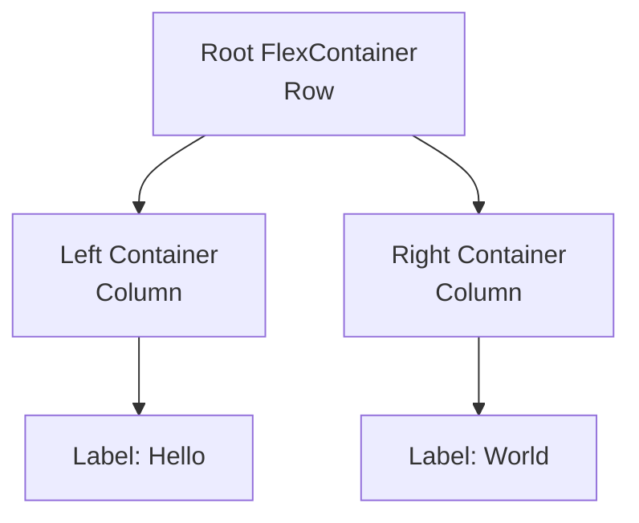
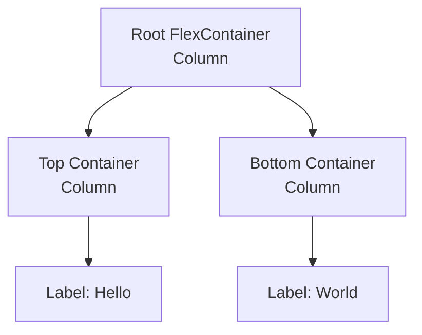
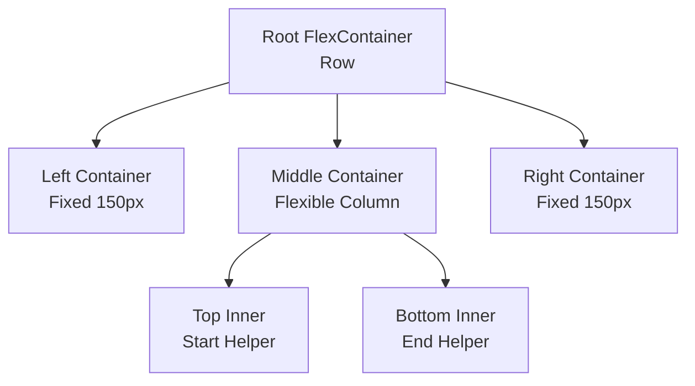
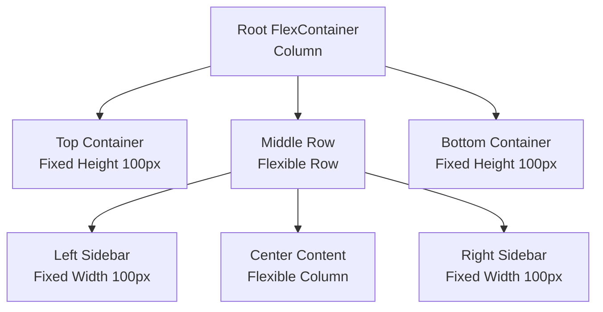
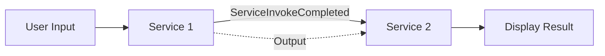
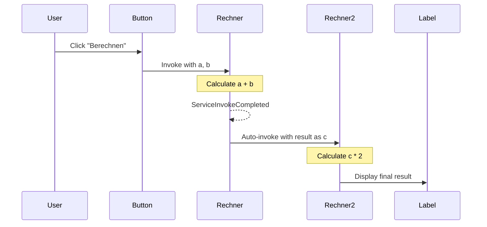

# Mashup Creation Recipes

This document collects proven recipes for programmatically creating ThingWorx Mashups. These recipes are designed to be used by agents or developers to quickly generate correct Mashup structures.

## Recipe 1: Two-Column Responsive Layout

This recipe creates a responsive Mashup with two side-by-side columns, each containing a centered label.

### Purpose
*   Demonstrates correct nesting of `flexcontainer` widgets.
*   Shows how to use `flex-direction: row` vs `column`.
*   Uses modern `ptcslabel` widgets.

### Structure


### Key JSON Properties

#### 1. Root Container
The root container holds the two columns. It uses `row` direction to place them side-by-side.
```javascript
{
    "Properties": {
        "Type": "flexcontainer",
        "flex-direction": "row", // Horizontal layout
        "align-items": "center",
        "justify-content": "space-around", // Space out columns
        "flex-grow": 1,
        "ResponsiveLayout": true
    },
    "Widgets": [ ... ]
}
```

#### 2. Child Containers (Columns)
Each child container holds content (ex. a label). It uses `column` direction (default vertical stacking) and centers its content.
```javascript
{
    "Properties": {
        "Type": "flexcontainer",
        "flex-direction": "column",
        "align-items": "center",
        "justify-content": "center", // Center content vertically
        "flex-grow": 1, // fill available space
        "ResponsiveLayout": true
    },
    "Widgets": [ ... ]
}
```

### Full Creation Script Template

Use this script as a template to create this layout. Remember to update `MASHUP_NAME`.

```javascript
const fs = require('fs');
const path = require('path');

// Load config
const envPath = path.join(__dirname, '.env.example');
const envContent = fs.readFileSync(envPath, 'utf8');
const config = {};
envContent.split('\n').forEach(line => {
    const [key, value] = line.split('=');
    if (key && value) config[key.trim()] = value.trim();
});

const BASE_URL = config.THINGWORX_BASE_URL;
const APP_KEY = config.THINGWORX_APP_KEY;
const MASHUP_NAME = "antigravity.hello-world-mu"; // CHANGE THIS NAME

async function createMashup() {
    console.log(`Creating Mashup: ${MASHUP_NAME}...`);

    const mashupContent = {
        "UI": {
            "Properties": {
                "Id": "mashup-root",
                "Type": "mashup",
                "ResponsiveLayout": true,
                "Width": 1024,
                "Height": 618,
                "Style": "DefaultMashupStyle",
                "StyleTheme": "PTC Convergence Theme",
                "Title": "Hello World Mashup",
                "Area": "Mashup",
                "__TypeDisplayName": "Mashup",
                "Visible": true,
                "Z-index": 10,
                "Top": 0,
                "Left": 0
            },
            "Widgets": [
                {
                    "Properties": {
                        "Type": "flexcontainer",
                        "__TypeDisplayName": "Responsive Container",
                        "Id": "flexcontainer-root",
                        "DisplayName": "root-container",
                        "flex-direction": "row",
                        "align-items": "center",
                        "justify-content": "space-around",
                        "flex-grow": 1,
                        "ResponsiveLayout": true,
                        "LastContainer": true
                    },
                    "Widgets": [
                        // Container 1 (Left)
                        {
                            "Properties": {
                                "Type": "flexcontainer",
                                "__TypeDisplayName": "Responsive Container",
                                "Id": "flexcontainer-1",
                                "DisplayName": "container-hello",
                                "flex-direction": "column",
                                "align-items": "center",
                                "justify-content": "center",
                                "flex-grow": 1,
                                "ResponsiveLayout": true
                            },
                            "Widgets": [
                                {
                                    "Properties": {
                                        "Type": "ptcslabel",
                                        "__TypeDisplayName": "Label",
                                        "Id": "ptcslabel-hello",
                                        "DisplayName": "lblHello",
                                        "LabelText": "Hello",
                                        "HorizontalAlignment": "left",
                                        "VerticalAlignment": "flex-start",
                                        "UseTheme": true,
                                        "Visible": true
                                    },
                                    "Widgets": []
                                }
                            ]
                        },
                        // Container 2 (Right)
                        {
                            "Properties": {
                                "Type": "flexcontainer",
                                "__TypeDisplayName": "Responsive Container",
                                "Id": "flexcontainer-2",
                                "DisplayName": "container-world",
                                "flex-direction": "column",
                                "align-items": "center",
                                "justify-content": "center",
                                "flex-grow": 1,
                                "ResponsiveLayout": true
                            },
                            "Widgets": [
                                {
                                    "Properties": {
                                        "Type": "ptcslabel",
                                        "__TypeDisplayName": "Label",
                                        "Id": "ptcslabel-world",
                                        "DisplayName": "lblWorld",
                                        "LabelText": "World",
                                        "HorizontalAlignment": "left",
                                        "VerticalAlignment": "flex-start",
                                        "UseTheme": true,
                                        "Visible": true
                                    },
                                    "Widgets": []
                                }
                            ]
                        }
                    ]
                }
            ]
        },
        "Data": {
            "Session": {
                "DataName": "Session",
                "EntityName": "",
                "EntityType": "Session",
                "Id": "session",
                "Services": [{
                    "Id": "SessionInterface",
                    "Name": "GetGlobalSessionValues",
                    "Characteristic": "Services",
                    "Target": "GetGlobalSessionValues",
                    "APIMethod": "post",
                    "RefreshInterval": 0,
                    "Parameters": {}
                }]
            },
            "UserExtensions": {
                "DataName": "UserExtensions",
                "EntityName": "",
                "EntityType": "UserExtensions",
                "Id": "UserExtensions",
                "Services": [{
                    "Id": "UserExtensionInterface",
                    "Name": "GetCurrentUserExtensionProperties",
                    "Characteristic": "Services",
                    "Target": "GetCurrentUserExtensionProperties",
                    "APIMethod": "post",
                    "RefreshInterval": 0,
                    "Parameters": {}
                }]
            }
        },
        "Events": [],
        "DataBindings": [],
        "mashupType": "mashup"
    };

    // Construct Payload
    const payload = {
        "entityType": "Mashups",
        "name": MASHUP_NAME,
        "description": "Recipe Created Mashup",
        "configurationTables": {
            "MobileSettings": {
                "name": "MobileSettings",
                "isHidden": true,
                "dataShape": {
                     "fieldDefinitions": {
                        "initialScale": { "baseType": "NUMBER", "name": "initialScale", "aspects": { "defaultValue": 1 } },
                        "width": { "baseType": "STRING", "name": "width", "aspects": { "defaultValue": "device-width" } },
                        "height": { "baseType": "STRING", "name": "height", "aspects": { "defaultValue": "device-height" } },
                        "minimumScale": { "baseType": "NUMBER", "name": "minimumScale", "aspects": { "defaultValue": 0.1 } },
                        "maximumScale": { "baseType": "NUMBER", "name": "maximumScale", "aspects": { "defaultValue": 10 } },
                        "disableZoom": { "baseType": "BOOLEAN", "name": "disableZoom", "aspects": { "defaultValue": false } },
                        "fullScreenMode": { "baseType": "BOOLEAN", "name": "fullScreenMode", "aspects": { "defaultValue": true } },
                        "iosStatusBarAppearance": { "baseType": "STRING", "name": "iosStatusBarAppearance", "aspects": { "defaultValue": "default" } },
                        "iosShortcutIconTitle": { "baseType": "STRING", "name": "iosShortcutIconTitle", "aspects": { "defaultValue": "" } }
                    }
                },
                "rows": [{
                    "initialScale": 1,
                    "width": "device-width",
                    "height": "device-height",
                    "minimumScale": 0.1,
                    "maximumScale": 10,
                    "disableZoom": false,
                    "fullScreenMode": true,
                    "iosStatusBarAppearance": "black-translucent",
                    "iosShortcutIconTitle": ""
                }]
            }
        },
        "aspects": {
            "mashupType": "mashup",
            "isResponsive": true,
            "isFlex": true
        },
        "mashupContent": JSON.stringify(mashupContent),
        "projectName": "PTCDefaultProject"
    };

    // Send Request
    const url = `${BASE_URL}/Mashups?Content-Type=application%2Fjson&reason=created%20by%20Antigravity`;
    const response = await fetch(url, {
        method: 'PUT',
        headers: {
            'appKey': APP_KEY,
            'Content-Type': 'application/json',
            'Accept': 'application/json'
        },
        body: JSON.stringify(payload)
    });

    if (!response.ok) {
        const text = await response.text();
        console.error(`Failed to create mashup: ${response.status} ${response.statusText}`);
        console.error(text);
    } else {
        console.log(`✓ Mashup '${MASHUP_NAME}' created successfully!`);
        console.log(`  View it at: ${BASE_URL}/Mashups/${MASHUP_NAME}`);
    }
}

createMashup();
```

## Recipe 2: Vertical Stacked Layout

This recipe creates a responsive Mashup with two stacked containers (one above the other), each containing a centered label.

### Purpose
*   Demonstrates vertical stacking using `flex-direction: column` on the root.
*   Shows how to structure simple dashboard-like vertical sections.

### Structure


### Key JSON Properties

#### 1. Root Container
The root container uses `column` direction to stack children vertically.
```javascript
{
    "Properties": {
        "Type": "flexcontainer",
        "flex-direction": "column", // Vertical layout
        "align-items": "center",
        "justify-content": "center",
        "flex-grow": 1,
        "ResponsiveLayout": true
    },
    "Widgets": [ ... ]
}
```

### Full Creation Script Template

Use this script as a template to create this layout. Remember to update `MASHUP_NAME`.

```javascript
const fs = require('fs');
const path = require('path');

// Load config
const envPath = path.join(__dirname, '.env.example');
const envContent = fs.readFileSync(envPath, 'utf8');
const config = {};
envContent.split('\n').forEach(line => {
    const [key, value] = line.split('=');
    if (key && value) config[key.trim()] = value.trim();
});

const BASE_URL = config.THINGWORX_BASE_URL;
const APP_KEY = config.THINGWORX_APP_KEY;
const MASHUP_NAME = "antigravity.hello-world-vertical-mu"; // CHANGE THIS NAME

async function createMashup() {
    console.log(`Creating Mashup: ${MASHUP_NAME}...`);

    const mashupContent = {
        "UI": {
            "Properties": {
                "Id": "mashup-root",
                "Type": "mashup",
                "ResponsiveLayout": true,
                "Width": 1024,
                "Height": 618,
                "Style": "DefaultMashupStyle",
                "StyleTheme": "PTC Convergence Theme",
                "Title": "Hello World Vertical Mashup",
                "Area": "Mashup",
                "__TypeDisplayName": "Mashup",
                "Visible": true,
                "Z-index": 10,
                "Top": 0,
                "Left": 0
            },
            "Widgets": [
                {
                    "Properties": {
                        "Type": "flexcontainer",
                        "__TypeDisplayName": "Responsive Container",
                        "Id": "flexcontainer-root",
                        "DisplayName": "root-container",
                        "flex-direction": "column", // Vertical Stacking
                        "align-items": "center",
                        "justify-content": "center",
                        "flex-grow": 1,
                        "ResponsiveLayout": true,
                        "LastContainer": true
                    },
                    "Widgets": [
                        // Container 1 (Top)
                        {
                            "Properties": {
                                "Type": "flexcontainer",
                                "__TypeDisplayName": "Responsive Container",
                                "Id": "flexcontainer-top",
                                "DisplayName": "container-hello",
                                "flex-direction": "column",
                                "align-items": "center",
                                "justify-content": "center",
                                "flex-grow": 1,
                                "ResponsiveLayout": true
                            },
                            "Widgets": [
                                {
                                    "Properties": {
                                        "Type": "ptcslabel",
                                        "__TypeDisplayName": "Label",
                                        "Id": "ptcslabel-hello",
                                        "DisplayName": "lblHello",
                                        "LabelText": "Hello",
                                        "HorizontalAlignment": "left",
                                        "VerticalAlignment": "flex-start",
                                        "UseTheme": true,
                                        "Visible": true
                                    },
                                    "Widgets": []
                                }
                            ]
                        },
                        // Container 2 (Bottom)
                        {
                            "Properties": {
                                "Type": "flexcontainer",
                                "__TypeDisplayName": "Responsive Container",
                                "Id": "flexcontainer-bottom",
                                "DisplayName": "container-world",
                                "flex-direction": "column",
                                "align-items": "center",
                                "justify-content": "center",
                                "flex-grow": 1,
                                "ResponsiveLayout": true
                            },
                            "Widgets": [
                                {
                                    "Properties": {
                                        "Type": "ptcslabel",
                                        "__TypeDisplayName": "Label",
                                        "Id": "ptcslabel-world",
                                        "DisplayName": "lblWorld",
                                        "LabelText": "World",
                                        "HorizontalAlignment": "left",
                                        "VerticalAlignment": "flex-start",
                                        "UseTheme": true,
                                        "Visible": true
                                    },
                                    "Widgets": []
                                }
                            ]
                        }
                    ]
                }
            ]
        },
        "Data": {
            "Session": {
                "DataName": "Session",
                "EntityName": "",
                "EntityType": "Session",
                "Id": "session",
                "Services": [{
                    "Id": "SessionInterface",
                    "Name": "GetGlobalSessionValues",
                    "Characteristic": "Services",
                    "Target": "GetGlobalSessionValues",
                    "APIMethod": "post",
                    "RefreshInterval": 0,
                    "Parameters": {}
                }]
            },
            "UserExtensions": {
                "DataName": "UserExtensions",
                "EntityName": "",
                "EntityType": "UserExtensions",
                "Id": "UserExtensions",
                "Services": [{
                    "Id": "UserExtensionInterface",
                    "Name": "GetCurrentUserExtensionProperties",
                    "Characteristic": "Services",
                    "Target": "GetCurrentUserExtensionProperties",
                    "APIMethod": "post",
                    "RefreshInterval": 0,
                    "Parameters": {}
                }]
            }
        },
        "Events": [],
        "DataBindings": [],
        "mashupType": "mashup"
    };

    const payload = {
        "entityType": "Mashups",
        "name": MASHUP_NAME,
        "description": "Hello World Vertical Mashup",
        "configurationTables": {
            "MobileSettings": {
                "name": "MobileSettings",
                "isHidden": true,
                "dataShape": {
                     "fieldDefinitions": {
                        "initialScale": { "baseType": "NUMBER", "name": "initialScale", "aspects": { "defaultValue": 1 } },
                        "width": { "baseType": "STRING", "name": "width", "aspects": { "defaultValue": "device-width" } },
                        "height": { "baseType": "STRING", "name": "height", "aspects": { "defaultValue": "device-height" } },
                        "minimumScale": { "baseType": "NUMBER", "name": "minimumScale", "aspects": { "defaultValue": 0.1 } },
                        "maximumScale": { "baseType": "NUMBER", "name": "maximumScale", "aspects": { "defaultValue": 10 } },
                        "disableZoom": { "baseType": "BOOLEAN", "name": "disableZoom", "aspects": { "defaultValue": false } },
                        "fullScreenMode": { "baseType": "BOOLEAN", "name": "fullScreenMode", "aspects": { "defaultValue": true } },
                        "iosStatusBarAppearance": { "baseType": "STRING", "name": "iosStatusBarAppearance", "aspects": { "defaultValue": "default" } },
                        "iosShortcutIconTitle": { "baseType": "STRING", "name": "iosShortcutIconTitle", "aspects": { "defaultValue": "" } }
                    }
                },
                "rows": [{
                    "initialScale": 1,
                    "width": "device-width",
                    "height": "device-height",
                    "minimumScale": 0.1,
                    "maximumScale": 10,
                    "disableZoom": false,
                    "fullScreenMode": true,
                    "iosStatusBarAppearance": "black-translucent",
                    "iosShortcutIconTitle": ""
                }]
            }
        },
        "aspects": {
            "mashupType": "mashup",
            "isResponsive": true,
            "isFlex": true
        },
        "mashupContent": JSON.stringify(mashupContent),
        "projectName": "PTCDefaultProject"
    };

    const url = `${BASE_URL}/Mashups?Content-Type=application%2Fjson&reason=created%20by%20Antigravity`;

    const response = await fetch(url, {
        method: 'PUT',
        headers: {
            'appKey': APP_KEY,
            'Content-Type': 'application/json',
            'Accept': 'application/json'
        },
        body: JSON.stringify(payload)
    });

    if (!response.ok) {
        const text = await response.text();
        console.error(`Failed to create mashup: ${response.status} ${response.statusText}`);
        console.error(text);
    } else {
        console.log(`✓ Mashup '${MASHUP_NAME}' created successfully!`);
        console.log(`  View it at: ${BASE_URL}/Mashups/${MASHUP_NAME}`);
    }
}

createMashup();
```

## Recipe 3: Complex Fixed Sidebar Layout

This recipe demonstrates a more advanced layout commonly used for applications: A main workspace flanked by fixed-width static sidebars (e.g., for navigation or tool panels).

### Purpose
*   **Mixing Static & Responsive**: Shows how to keep sidebars fixed while the center content grows.
*   **Strict Flex Sizing**: Demonstrates the use of explicit `flex-min-width` and `flex-max-width` to force containers to adhere to specific pixel dimensions.
*   **Empty Static Containers**: Shows configuration for structural containers that may be populated dynamically at runtime or used for spacing.

### Structure


### Key JSON Properties

#### 1. Fixed Sidebar Containers
To force a container to be exactly 150px wide and **never** resize, you must use a combination of standard properties and strict flex properties.

**Critical Properties**:
*   `ResponsiveLayout`: `false` (Treats internal layout as static canvas, good for fixed tools).
*   `flex-grow`: `0` (Do not grow).
*   `flex-shrink`: `0` (Do not shrink).
*   `flex-basis`: `"150px"` (Initial size).
*   `flex-min-width`: `"150px"` (Hard floor).
*   `flex-max-width`: `"150px"` (Hard ceiling).

```javascript
{
    "Properties": {
        "Type": "flexcontainer",
        "Id": "flexcontainer-left",
        "DisplayName": "FixedSidebar",
        "ResponsiveLayout": false, // Static internal
        "Width": 150,
        "MinWidth": 150,
        "MaxWidth": 150,
        // STRICT FLEX LOCKING
        "flex-grow": 0,
        "flex-shrink": 0,
        "flex-basis": "150px",
        "flex-min-width": "150px",
        "flex-max-width": "150px"
    },
    "Widgets": []
}
```

### Full Creation Script Template

Use this script to generate the complex layout.

```javascript
const fs = require('fs');
const path = require('path');

// Load config
const envPath = path.join(__dirname, '.env.example');
const envContent = fs.readFileSync(envPath, 'utf8');
const config = {};
envContent.split('\n').forEach(line => {
    const [key, value] = line.split('=');
    if (key && value) config[key.trim()] = value.trim();
});

const BASE_URL = config.THINGWORX_BASE_URL;
const APP_KEY = config.THINGWORX_APP_KEY;
const MASHUP_NAME = "antigravity.complex-layout-mu"; // CHANGE THIS NAME

async function createMashup() {
    console.log(`Creating Mashup: ${MASHUP_NAME}...`);

    const mashupContent = {
        "UI": {
            "Properties": {
                "Id": "mashup-root",
                "Type": "mashup",
                "ResponsiveLayout": true,
                "Width": 1024,
                "Height": 618,
                "Style": "DefaultMashupStyle",
                "StyleTheme": "PTC Convergence Theme",
                "Title": "Complex Layout Mashup",
                "Area": "Mashup",
                "__TypeDisplayName": "Mashup",
                "Visible": true,
                "Z-index": 10,
                "Top": 0,
                "Left": 0
            },
            "Widgets": [
                {
                    "Properties": {
                        "Type": "flexcontainer",
                        "__TypeDisplayName": "Responsive Container",
                        "Id": "flexcontainer-root",
                        "DisplayName": "root-row",
                        "flex-direction": "row", // Horizontal main layout
                        "align-items": "stretch",
                        "justify-content": "flex-start",
                        "flex-grow": 1,
                        "ResponsiveLayout": true,
                        "LastContainer": true
                    },
                    "Widgets": [
                        // 1. LEFT CONTAINER (Fixed 150px, Static)
                        {
                            "Properties": {
                                "Type": "flexcontainer",
                                "__TypeDisplayName": "Responsive Container",
                                "Id": "flexcontainer-left",
                                "DisplayName": "container-left-fixed",
                                // "Static" internal behavior
                                "ResponsiveLayout": false,
                                "Width": 150,
                                "MinWidth": 150,
                                "MaxWidth": 150,
                                // Strict Flex Fixed sizing
                                "flex-grow": 0,
                                "flex-shrink": 0,
                                "flex-basis": "150px",
                                "flex-min-width": "150px",
                                "flex-max-width": "150px",
                                "Style": "DefaultContainerStyle"
                            },
                            "Widgets": [] // Empty as requested
                        },
                        // 2. MIDDLE CONTAINER (Flexible, Vertical Stack)
                        {
                            "Properties": {
                                "Type": "flexcontainer",
                                "__TypeDisplayName": "Responsive Container",
                                "Id": "flexcontainer-middle",
                                "DisplayName": "container-middle-flex",
                                "flex-direction": "column", // Vertical stack inside
                                "align-items": "stretch",
                                "justify-content": "flex-start",
                                "flex-grow": 1, // Take remaining space
                                "ResponsiveLayout": true
                            },
                            "Widgets": [
                                // Top Inner (Hello)
                                {
                                    "Properties": {
                                        "Type": "flexcontainer",
                                        "Id": "flexcontainer-mid-top",
                                        "DisplayName": "container-hello",
                                        "flex-direction": "column",
                                        "align-items": "center",
                                        "justify-content": "center",
                                        "flex-grow": 1,
                                        "ResponsiveLayout": true
                                    },
                                    "Widgets": [
                                        {
                                            "Properties": {
                                                "Type": "ptcslabel",
                                                "Id": "ptcslabel-hello",
                                                "LabelText": "Hello",
                                                "Visible": true
                                            },
                                            "Widgets": []
                                        }
                                    ]
                                },
                                // Bottom Inner (World)
                                {
                                    "Properties": {
                                        "Type": "flexcontainer",
                                        "Id": "flexcontainer-mid-bottom",
                                        "DisplayName": "container-world",
                                        "flex-direction": "column",
                                        "align-items": "center",
                                        "justify-content": "center",
                                        "flex-grow": 1,
                                        "ResponsiveLayout": true
                                    },
                                    "Widgets": [
                                        {
                                            "Properties": {
                                                "Type": "ptcslabel",
                                                "Id": "ptcslabel-world",
                                                "LabelText": "World",
                                                "Visible": true
                                            },
                                            "Widgets": []
                                        }
                                    ]
                                }
                            ]
                        },
                        // 3. RIGHT CONTAINER (Fixed 150px, Static)
                        {
                            "Properties": {
                                "Type": "flexcontainer",
                                "__TypeDisplayName": "Responsive Container",
                                "Id": "flexcontainer-right",
                                "DisplayName": "container-right-fixed",
                                // "Static" internal behavior
                                "ResponsiveLayout": false,
                                "Width": 150,
                                "MinWidth": 150,
                                "MaxWidth": 150,
                                // Strict Flex Fixed sizing
                                "flex-grow": 0,
                                "flex-shrink": 0,
                                "flex-basis": "150px",
                                "flex-min-width": "150px",
                                "flex-max-width": "150px",
                                "Style": "DefaultContainerStyle"
                            },
                            "Widgets": [] // Empty as requested
                        }
                    ]
                }
            ]
        },
        "Data": {
            "Session": {
                "DataName": "Session",
                "EntityName": "",
                "EntityType": "Session",
                "Id": "session",
                "Services": [{
                    "Id": "SessionInterface",
                    "Name": "GetGlobalSessionValues",
                    "Characteristic": "Services",
                    "Target": "GetGlobalSessionValues",
                    "APIMethod": "post",
                    "RefreshInterval": 0,
                    "Parameters": {}
                }]
            },
            "UserExtensions": {
                "DataName": "UserExtensions",
                "EntityName": "",
                "EntityType": "UserExtensions",
                "Id": "UserExtensions",
                "Services": [{
                    "Id": "UserExtensionInterface",
                    "Name": "GetCurrentUserExtensionProperties",
                    "Characteristic": "Services",
                    "Target": "GetCurrentUserExtensionProperties",
                    "APIMethod": "post",
                    "RefreshInterval": 0,
                    "Parameters": {}
                }]
            }
        },
        "Events": [],
        "DataBindings": [],
        "mashupType": "mashup"
    };

    // DELETE existing mashup first to avoid 409
    try {
        console.log(`Deleting existing Mashup (if any): ${MASHUP_NAME}...`);
        await fetch(`${BASE_URL}/Mashups/${MASHUP_NAME}`, {
            method: 'DELETE',
            headers: {
                'appKey': APP_KEY,
                'Content-Type': 'application/json',
                'Accept': 'application/json'
            }
        });
    } catch (e) {
        // Ignore delete errors
    }

    const payload = {
        "entityType": "Mashups",
        "name": MASHUP_NAME,
        "description": "Complex Layout Mashup (Left/Right Fixed Static 150px, Center Split)",
        "configurationTables": {
            "MobileSettings": {
                "name": "MobileSettings",
                "isHidden": true,
                "dataShape": {
                     "fieldDefinitions": {
                        "initialScale": { "baseType": "NUMBER", "name": "initialScale", "aspects": { "defaultValue": 1 } },
                        "width": { "baseType": "STRING", "name": "width", "aspects": { "defaultValue": "device-width" } },
                        "height": { "baseType": "STRING", "name": "height", "aspects": { "defaultValue": "device-height" } },
                        "minimumScale": { "baseType": "NUMBER", "name": "minimumScale", "aspects": { "defaultValue": 0.1 } },
                        "maximumScale": { "baseType": "NUMBER", "name": "maximumScale", "aspects": { "defaultValue": 10 } },
                        "disableZoom": { "baseType": "BOOLEAN", "name": "disableZoom", "aspects": { "defaultValue": false } },
                        "fullScreenMode": { "baseType": "BOOLEAN", "name": "fullScreenMode", "aspects": { "defaultValue": true } },
                        "iosStatusBarAppearance": { "baseType": "STRING", "name": "iosStatusBarAppearance", "aspects": { "defaultValue": "default" } },
                        "iosShortcutIconTitle": { "baseType": "STRING", "name": "iosShortcutIconTitle", "aspects": { "defaultValue": "" } }
                    }
                },
                "rows": [{
                    "initialScale": 1,
                    "width": "device-width",
                    "height": "device-height",
                    "minimumScale": 0.1,
                    "maximumScale": 10,
                    "disableZoom": false,
                    "fullScreenMode": true,
                    "iosStatusBarAppearance": "black-translucent",
                    "iosShortcutIconTitle": ""
                }]
            }
        },
        "aspects": {
            "mashupType": "mashup",
            "isResponsive": true,
            "isFlex": true
        },
        "mashupContent": JSON.stringify(mashupContent),
        "projectName": "PTCDefaultProject"
    };

    const url = `${BASE_URL}/Mashups?Content-Type=application%2Fjson&reason=created%20by%20Antigravity`;

    const response = await fetch(url, {
        method: 'PUT',
        headers: {
            'appKey': APP_KEY,
            'Content-Type': 'application/json',
            'Accept': 'application/json'
        },
        body: JSON.stringify(payload)
    });

    if (!response.ok) {
        const text = await response.text();
        console.error(`Failed to create mashup: ${response.status} ${response.statusText}`);
        console.error(text);
    } else {
        console.log(`✓ Mashup '${MASHUP_NAME}' created successfully!`);
        console.log(`  View it at: ${BASE_URL}/Mashups/${MASHUP_NAME}`);
    }
}

createMashup();
```

## Recipe 4: Border Layout (Holy Grail)

This recipe implements a classic "Holy Grail" or "Border Layout": Header, Footer, Left Sidebar, Right Sidebar, and a flexible Center content area.

### Purpose
*   **Full Application Layout**: Typical dashboard structure.
*   **Nested Flex Stacks**: Uses a vertical stack for the main structure (Header / Middle / Footer) and a horizontal stack for the middle section (Left / Center / Right).
*   **Fixed Dimension Containers**: Demonstrates locking height for headers/footers and width for sidebars.

### Structure


### Key JSON Properties

#### 1. Header/Footer (Fixed Height)
To fix vertical height, use `MinHeight`, `MaxHeight`, and matching flex properties.
```javascript
{
    "Properties": {
        "Type": "flexcontainer",
        "ResponsiveLayout": false,
        "Height": 100,
        "MinHeight": 100,
        "MaxHeight": 100,
        "flex-grow": 0,
        "flex-shrink": 0,
        "flex-basis": "100px",
        "flex-min-height": "100px",
        "flex-max-height": "100px"
    },
    "Widgets": []
}
```

#### 2. Sidebars (Fixed Width)
Same concept but using Width properties.
```javascript
{
    "Properties": {
        "Type": "flexcontainer",
        "ResponsiveLayout": false,
        "Width": 100,
        "MinWidth": 100,
        "MaxWidth": 100,
        "flex-grow": 0,
        "flex-shrink": 0,
        "flex-basis": "100px",
        "flex-min-width": "100px",
        "flex-max-width": "100px"
    },
    "Widgets": []
}
```


## Recipe 5: Using a Master Mashup

You can assign a **Master Mashup** to your new Mashup to inherit common header, footer, or navigation elements.

### Usage
To specify a Master Mashup, add the `"Master"` property to the root `UI` -> `Properties` object in your JSON definition.

### JSON Snippet
```javascript
"UI": {
    "Properties": {
        "Id": "mashup-root",
        "Type": "mashup",
        "ResponsiveLayout": true,
        "Title": "My Mashup with Master",
        // ... other properties ...
        "Master": "antigravity.Master-mm" // Add this line!
    },
    "Widgets": [ ... ]
}
```

### Important Notes
*   **Name Validation**: Ensure the Master Mashup name (`antigravity.Master-mm` in the example) exists on the server *before* you create your child mashup, otherwise creation might fail or the mashup will be broken.
*   **Layout Inheritance**: Your mashup's content will be injected into the `Content` placeholder of the Master Mashup.

## Recipe 6: Integrating Thing Services into Mashups

This recipe demonstrates how to add services from external Things to your Mashup, making them available for data binding, event handling, and service invocation.

### Purpose
*   **External Service Integration**: Shows how to register services from Things in the Mashup's Data section.
*   **Service Configuration**: Explains the structure and properties needed to properly configure Thing services.
*   **Real-World Example**: Uses the `ServiceHelper` Thing with its `Rechner` service as a practical example.

### When to Use
Use this pattern when you need to:
*   Call services from Things in response to user actions (e.g., button clicks)
*   Bind Thing service results to UI widgets (e.g., display calculation results)
*   Access Thing properties or methods from within the Mashup
*   Create interactive dashboards that communicate with backend Things

### Data Section Structure

The `Data` section of a Mashup contains all external data sources. By default, every Mashup includes `Session` and `UserExtensions`. To add Thing services, you add a new entry for each Thing.

#### Basic Structure
```javascript
"Data": {
    "Session": { ... },           // Always present
    "UserExtensions": { ... },    // Always present
    "YourThingName": {            // Add your Thing here
        "DataName": "YourThingName",
        "EntityName": "YourThingName",
        "EntityType": "Things",   // Critical: Must be "Things" for Thing entities
        "Id": "YourThingName",
        "Services": [ ... ]       // Array of services to register
    }
}
```

### Adding a Thing as a Data Source

To add a Thing to your Mashup, you need to specify:

| Property | Description | Example |
|----------|-------------|---------|
| `DataName` | Display name for the data source | `"ServiceHelper"` |
| `EntityName` | Exact name of the Thing on the server | `"ServiceHelper"` |
| `EntityType` | Type of entity - **must be `"Things"`** | `"Things"` |
| `Id` | Unique identifier within the Mashup | `"ServiceHelper"` |
| `Services` | Array of service definitions | `[{ ... }]` |

> [!IMPORTANT]
> The `EntityType` must be exactly `"Things"` (case-sensitive) for Thing entities. Other entity types include `"Session"`, `"UserExtensions"`, `"Resources"`, etc.

### Registering Services

Each service in the `Services` array must be configured with the following properties:

```javascript
{
    "Id": "UniqueServiceId",        // Unique ID for this service instance
    "Name": "ServiceName",          // Exact name of the service on the Thing
    "Characteristic": "Services",   // Always "Services" for service calls
    "Target": "ServiceName",        // Same as Name - the service to invoke
    "APIMethod": "post",            // HTTP method - always "post" for services
    "RefreshInterval": 0,           // Auto-refresh interval in ms (0 = manual only)
    "Parameters": {}                // Service parameters (if any)
}
```

#### Service Properties Explained

*   **Id**: A unique identifier for this service within the Mashup. Can be descriptive (e.g., `"RechnerService"`) or match the service name.
*   **Name**: The exact name of the service as defined on the Thing. **Case-sensitive**.
*   **Characteristic**: Always set to `"Services"` when registering a service.
*   **Target**: The service method to call. Typically the same as `Name`.
*   **APIMethod**: Always `"post"` for service invocations.
*   **RefreshInterval**: How often to auto-refresh the service (in milliseconds). Set to `0` for manual invocation only.
*   **Parameters**: An object containing default parameter values. Can be empty `{}` if parameters will be bound dynamically.

### Complete Example: ServiceHelper with Rechner Service

This example shows how to add the `Rechner` service from the `ServiceHelper` Thing.

```javascript
const mashupContent = {
    "UI": {
        "Properties": {
            "Id": "mashup-root",
            "Type": "mashup",
            "ResponsiveLayout": true,
            "Width": 1024,
            "Height": 618,
            "Style": "DefaultMashupStyle",
            "StyleTheme": "PTC Convergence Theme",
            "Title": "Service Helper Mashup",
            "Area": "Mashup",
            "__TypeDisplayName": "Mashup",
            "Visible": true,
            "Z-index": 10,
            "Top": 0,
            "Left": 0
        },
        "Widgets": [
            {
                "Properties": {
                    "Type": "flexcontainer",
                    "__TypeDisplayName": "Responsive Container",
                    "Id": "flexcontainer-root",
                    "DisplayName": "root-container",
                    "flex-direction": "column",
                    "align-items": "center",
                    "justify-content": "center",
                    "flex-grow": 1,
                    "ResponsiveLayout": true,
                    "LastContainer": true
                },
                "Widgets": []
            }
        ]
    },
    "Data": {
        "Session": {
            "DataName": "Session",
            "EntityName": "",
            "EntityType": "Session",
            "Id": "session",
            "Services": [{
                "Id": "SessionInterface",
                "Name": "GetGlobalSessionValues",
                "Characteristic": "Services",
                "Target": "GetGlobalSessionValues",
                "APIMethod": "post",
                "RefreshInterval": 0,
                "Parameters": {}
            }]
        },
        "UserExtensions": {
            "DataName": "UserExtensions",
            "EntityName": "",
            "EntityType": "UserExtensions",
            "Id": "UserExtensions",
            "Services": [{
                "Id": "UserExtensionInterface",
                "Name": "GetCurrentUserExtensionProperties",
                "Characteristic": "Services",
                "Target": "GetCurrentUserExtensionProperties",
                "APIMethod": "post",
                "RefreshInterval": 0,
                "Parameters": {}
            }]
        },
        // ===== ADD YOUR THING HERE =====
        "ServiceHelper": {
            "DataName": "ServiceHelper",
            "EntityName": "ServiceHelper",      // Exact Thing name on server
            "EntityType": "Things",             // Must be "Things"
            "Id": "ServiceHelper",
            "Services": [{
                "Id": "RechnerService",         // Unique ID for this service
                "Name": "Rechner",              // Exact service name (case-sensitive)
                "Characteristic": "Services",
                "Target": "Rechner",
                "APIMethod": "post",
                "RefreshInterval": 0,
                "Parameters": {}                // Add parameters if needed
            }]
        }
    },
    "Events": [],
    "DataBindings": [],
    "mashupType": "mashup"
};
```

### Adding Multiple Services from the Same Thing

You can register multiple services from the same Thing by adding more entries to the `Services` array:

```javascript
"ServiceHelper": {
    "DataName": "ServiceHelper",
    "EntityName": "ServiceHelper",
    "EntityType": "Things",
    "Id": "ServiceHelper",
    "Services": [
        {
            "Id": "RechnerService",
            "Name": "Rechner",
            "Characteristic": "Services",
            "Target": "Rechner",
            "APIMethod": "post",
            "RefreshInterval": 0,
            "Parameters": {}
        },
        {
            "Id": "AnotherService",
            "Name": "AnotherServiceName",
            "Characteristic": "Services",
            "Target": "AnotherServiceName",
            "APIMethod": "post",
            "RefreshInterval": 0,
            "Parameters": {}
        }
    ]
}
```

### Adding Multiple Things

To add services from multiple Things, add separate entries in the `Data` section:

```javascript
"Data": {
    "Session": { ... },
    "UserExtensions": { ... },
    "ServiceHelper": {
        "DataName": "ServiceHelper",
        "EntityName": "ServiceHelper",
        "EntityType": "Things",
        "Id": "ServiceHelper",
        "Services": [ ... ]
    },
    "AnotherThing": {
        "DataName": "AnotherThing",
        "EntityName": "AnotherThing",
        "EntityType": "Things",
        "Id": "AnotherThing",
        "Services": [ ... ]
    }
}
```

### Service Parameters

If your service requires parameters, you can specify default values in the `Parameters` object:

```javascript
{
    "Id": "CalculateService",
    "Name": "Calculate",
    "Characteristic": "Services",
    "Target": "Calculate",
    "APIMethod": "post",
    "RefreshInterval": 0,
    "Parameters": {
        "input1": 10,
        "input2": 20,
        "operation": "add"
    }
}
```

> [!NOTE]
> Parameters can also be bound dynamically from UI widgets using Data Bindings. The values in the `Parameters` object serve as defaults.

### Using the Service in the Mashup

Once registered, the service can be:
1. **Invoked by Events**: Bind a button's `Clicked` event to the service
2. **Bound to Widgets**: Bind service output to labels, grids, or other display widgets
3. **Chained with Other Services**: Use the output of one service as input to another

These bindings are configured in the `Events` and `DataBindings` sections of the Mashup JSON.

### Common Pitfalls

> [!WARNING]
> **Case Sensitivity**: Thing names and service names are case-sensitive. `"ServiceHelper"` is different from `"servicehelper"`.

> [!WARNING]
> **EntityType**: Always use `"Things"` (capital T) for Thing entities. Using `"Thing"` or `"things"` will fail.

> [!CAUTION]
> **Thing Existence**: Ensure the Thing exists on the server before creating the Mashup. If the Thing doesn't exist, the Mashup will be created but the service will not be available.

### Full Script Example

See [create_service_helper_mashup.js](file:///c:/Users/tk/IdeaProjects/CodeingAgentThingWorxDevelopmentEnvironment/create_service_helper_mashup.js) for a complete working example that creates a Mashup with the ServiceHelper Thing and Rechner service.

## Recipe 7: Interactive Mashups with Service Bindings and Events

This recipe demonstrates how to create fully interactive mashups that bind UI widgets to service parameters, invoke services on button clicks, and display service results. This is essential for creating functional applications.

### Purpose
*   **Complete Interactivity**: Shows how to create mashups where user actions trigger service calls
*   **Data Flow**: Demonstrates bidirectional data flow between UI and services
*   **Event Handling**: Explains how to bind button clicks to service invocations
*   **Real Example**: Uses a working calculator mashup as reference

### When to Use
Use this pattern when you need to:
*   Create forms that submit data to services
*   Build calculators or data processors
*   Implement search or filter functionality
*   Create any mashup where user input triggers backend processing

### Overview: The Three Key Components

1. **Service Integration** (Recipe 6): Add the Thing and its service to the Data section
2. **Data Bindings**: Connect UI widgets to service parameters and outputs
3. **Event Bindings**: Trigger service execution on user actions (e.g., button clicks)

### Event Binding Structure

Events bind user actions (like button clicks) to service invocations. The structure is different from DataBindings.

#### Event Binding Format

```javascript
"Events": [
    {
        "Id": "unique-event-id",
        "EventTriggerArea": "UI",              // Where the event originates
        "EventHandlerArea": "Data",            // Where the handler is (service)
        "EventTriggerSection": "",             // Empty for UI widgets
        "EventTriggerId": "button-widget-id",  // Widget that triggers the event
        "EventTriggerEvent": "Clicked",        // Event type (Clicked, Changed, etc.)
        "EventHandlerId": "ThingName",         // Thing name from Data section
        "EventHandlerService": "ServiceName"   // Service to invoke
    }
]
```

#### Key Properties

| Property | Description | Example |
|----------|-------------|---------|
| `EventTriggerArea` | Where event originates (`"UI"` or `"Data"`) | `"UI"` |
| `EventHandlerArea` | Where handler is located (`"Data"` or `"UI"`) | `"Data"` |
| `EventTriggerId` | ID of widget triggering event | `"ptcsbutton-calculate"` |
| `EventTriggerEvent` | Type of event | `"Clicked"`, `"Changed"`, `"SelectedRowsChanged"` |
| `EventHandlerId` | Thing name (matches Data section key) | `"ServiceHelper"` |
| `EventHandlerService` | Service name to invoke | `"Rechner"` |

> [!IMPORTANT]
> Event bindings use `EventTrigger*` and `EventHandler*` properties, **not** `Source*` and `Target*` like DataBindings.

### DataBinding Structure for Service Parameters

DataBindings connect UI widget values to service input parameters. This is how you pass user input to services.

#### Service Parameter Binding Format

```javascript
"DataBindings": [
    {
        "Id": "unique-binding-id",
        "SourceId": "widget-id",           // UI widget ID
        "SourceArea": "UI",
        "SourceSection": "",
        "SourceDetails": "",
        "TargetArea": "Data",
        "TargetSection": "ThingName",      // Thing name from Data section
        "TargetId": "ServiceName",         // Service name
        "PropertyMaps": [
            {
                "SourceProperty": "Value",              // Widget property
                "SourcePropertyType": "Property",
                "SourcePropertyBaseType": "NUMBER",     // Widget data type
                "TargetProperty": "parameterName",      // Service parameter name
                "TargetPropertyType": "Parameter",      // ⚠️ MUST be "Parameter"
                "TargetPropertyBaseType": "NUMBER"      // Service parameter type
            }
        ]
    }
]
```

#### Critical Properties for Service Parameters

| Property | Value | Why |
|----------|-------|-----|
| `TargetArea` | `"Data"` | Service is in Data section |
| `TargetSection` | Thing name | Matches key in Data section |
| `TargetId` | Service name | The service to bind to |
| `TargetPropertyType` | **`"Parameter"`** | ⚠️ Critical: Identifies service input parameter |
| `TargetPropertyBaseType` | Match service type | `"NUMBER"`, `"STRING"`, `"BOOLEAN"`, etc. |

> [!WARNING]
> **TargetPropertyType MUST be `"Parameter"`** for service input parameters. Using `"Property"` will not work.

### DataBinding Structure for Service Outputs

DataBindings also connect service results back to UI widgets for display.

#### Service Output Binding Format

```javascript
"DataBindings": [
    {
        "Id": "unique-binding-id",
        "SourceId": "ServiceName",         // Service name
        "SourceArea": "Data",
        "SourceSection": "ThingName",      // Thing name from Data section
        "SourceDetails": "AllData",        // ⚠️ MUST be "AllData" for service results
        "TargetArea": "UI",
        "TargetSection": "",
        "TargetId": "widget-id",           // UI widget ID
        "PropertyMaps": [
            {
                "SourceProperty": "resultFieldName",    // Service output field name
                "SourcePropertyType": "Field",          // ⚠️ MUST be "Field"
                "SourcePropertyBaseType": "NUMBER",     // Service output type
                "TargetProperty": "LabelText",          // Widget property
                "TargetPropertyType": "property",       // lowercase "property"
                "TargetPropertyBaseType": "STRING"      // Widget property type
            }
        ]
    }
]
```

#### Critical Properties for Service Outputs

| Property | Value | Why |
|----------|-------|-----|
| `SourceArea` | `"Data"` | Service is in Data section |
| `SourceSection` | Thing name | Matches key in Data section |
| `SourceId` | Service name | The service providing output |
| `SourceDetails` | **`"AllData"`** | ⚠️ Required for service results |
| `SourcePropertyType` | **`"Field"`** | ⚠️ Critical: Identifies service output field |

> [!WARNING]
> **SourcePropertyType MUST be `"Field"`** for service outputs. Using `"Property"` will not work.

> [!IMPORTANT]
> **SourceDetails MUST be `"AllData"`** for service output bindings.

### Complete Example: Calculator Mashup

This example shows a fully functional calculator that:
1. Takes two numeric inputs (Zahl A and Zahl B)
2. Invokes the ServiceHelper.Rechner service when button is clicked
3. Displays the result in a label

#### Data Section

```javascript
"Data": {
    "Session": { /* ... standard ... */ },
    "UserExtensions": { /* ... standard ... */ },
    "ServiceHelper": {
        "DataName": "ServiceHelper",
        "EntityName": "ServiceHelper",
        "EntityType": "Things",
        "Id": "ServiceHelper",
        "Services": [{
            "Id": "RechnerService",
            "Name": "Rechner",
            "Characteristic": "Services",
            "Target": "Rechner",
            "APIMethod": "post",
            "RefreshInterval": 0,
            "Parameters": {}
        }]
    }
}
```

#### UI Widgets

```javascript
"Widgets": [
    {
        "Properties": {
            "Type": "numericentry",
            "Id": "numericentry-a",
            "Label": "Zahl A:",
            "Value": 0
        }
    },
    {
        "Properties": {
            "Type": "numericentry",
            "Id": "numericentry-b",
            "Label": "Zahl B:",
            "Value": 0
        }
    },
    {
        "Properties": {
            "Type": "ptcsbutton",
            "Id": "ptcsbutton-calculate",
            "Label": "Berechnen"
        }
    },
    {
        "Properties": {
            "Type": "ptcslabel",
            "Id": "ptcslabel-result",
            "LabelText": "value ergebnis"
        }
    }
]
```

#### Events: Button Click → Service Invocation

```javascript
"Events": [
    {
        "Id": "event-button-invoke-rechner",
        "EventTriggerArea": "UI",
        "EventHandlerArea": "Data",
        "EventTriggerSection": "",
        "EventTriggerId": "ptcsbutton-calculate",
        "EventTriggerEvent": "Clicked",
        "EventHandlerId": "ServiceHelper",
        "EventHandlerService": "Rechner"
    }
]
```

#### DataBindings: Input A → Service Parameter a

```javascript
{
    "Id": "binding-input-a-to-service",
    "SourceId": "numericentry-a",
    "SourceArea": "UI",
    "SourceSection": "",
    "SourceDetails": "",
    "TargetArea": "Data",
    "TargetSection": "ServiceHelper",
    "TargetId": "Rechner",
    "PropertyMaps": [
        {
            "SourceProperty": "Value",
            "SourcePropertyType": "Property",
            "SourcePropertyBaseType": "NUMBER",
            "TargetProperty": "a",
            "TargetPropertyType": "Parameter",      // ⚠️ Parameter for service input
            "TargetPropertyBaseType": "NUMBER"
        }
    ]
}
```

#### DataBindings: Input B → Service Parameter b

```javascript
{
    "Id": "binding-input-b-to-service",
    "SourceId": "numericentry-b",
    "SourceArea": "UI",
    "SourceSection": "",
    "SourceDetails": "",
    "TargetArea": "Data",
    "TargetSection": "ServiceHelper",
    "TargetId": "Rechner",
    "PropertyMaps": [
        {
            "SourceProperty": "Value",
            "SourcePropertyType": "Property",
            "SourcePropertyBaseType": "NUMBER",
            "TargetProperty": "b",
            "TargetPropertyType": "Parameter",      // ⚠️ Parameter for service input
            "TargetPropertyBaseType": "NUMBER"
        }
    ]
}
```

#### DataBindings: Service Output → Label

```javascript
{
    "Id": "binding-service-result-to-label",
    "SourceId": "Rechner",
    "SourceArea": "Data",
    "SourceSection": "ServiceHelper",
    "SourceDetails": "AllData",                     // ⚠️ Required for service output
    "TargetArea": "UI",
    "TargetSection": "",
    "TargetId": "ptcslabel-result",
    "PropertyMaps": [
        {
            "SourceProperty": "result",
            "SourcePropertyType": "Field",          // ⚠️ Field for service output
            "SourcePropertyBaseType": "NUMBER",
            "TargetProperty": "LabelText",
            "TargetPropertyType": "property",
            "TargetPropertyBaseType": "STRING"
        }
    ]
}
```

### Critical Differences Summary

| Aspect | Service Parameter Binding | Service Output Binding |
|--------|--------------------------|------------------------|
| **Direction** | UI → Service | Service → UI |
| **SourceArea** | `"UI"` | `"Data"` |
| **TargetArea** | `"Data"` | `"UI"` |
| **TargetPropertyType** | **`"Parameter"`** | `"property"` |
| **SourcePropertyType** | `"Property"` | **`"Field"`** |
| **SourceDetails** | `""` | **`"AllData"`** |
| **TargetSection** | Thing name | `""` |
| **SourceSection** | `""` | Thing name |

### BaseType Matching

BaseTypes must be compatible between source and target:

| Widget Type | Widget Property | BaseType | Service Parameter Type |
|-------------|----------------|----------|----------------------|
| `numericentry` | `Value` | `NUMBER` | `NUMBER` ✅ |
| `ptcstextfield` | `Text` | `STRING` | `STRING` ✅ |
| `ptcscheckbox` | `Checked` | `BOOLEAN` | `BOOLEAN` ✅ |

> [!NOTE]
> Type conversions are allowed (e.g., NUMBER → STRING for display in labels), but matching types is preferred for service parameters.

### Common Event Types

| Widget | Event Name | Description |
|--------|-----------|-------------|
| `ptcsbutton` | `Clicked` | Button was clicked |
| `ptcstextfield` | `Changed` | Text value changed |
| `numericentry` | `Changed` | Numeric value changed |
| `ptcsgrid` | `SelectedRowsChanged` | Grid selection changed |
| `ptcscheckbox` | `Changed` | Checkbox state changed |

### Common Pitfalls

> [!CAUTION]
> **Wrong PropertyType for Parameters**: Using `TargetPropertyType: "Property"` instead of `"Parameter"` for service inputs will fail silently. The binding will appear in the mashup but won't work.

> [!CAUTION]
> **Wrong PropertyType for Outputs**: Using `SourcePropertyType: "Property"` instead of `"Field"` for service outputs will fail. Service results won't be displayed.

> [!CAUTION]
> **Missing AllData**: Forgetting `SourceDetails: "AllData"` for service output bindings will prevent results from being displayed.

> [!CAUTION]
> **BaseType Mismatch**: Binding a STRING widget to a NUMBER parameter without proper conversion may cause errors. Always match BaseTypes or ensure compatible conversions.

> [!WARNING]
> **Event Structure Confusion**: Don't use `SourceId`/`TargetId` in Events. Use `EventTriggerId`/`EventHandlerId` instead.

### Workflow Summary

1. **Add Service to Data Section** (Recipe 6)
   - Define Thing with EntityType: "Things"
   - Register service in Services array

2. **Create UI Widgets**
   - Input widgets (numericentry, ptcstextfield, etc.)
   - Action widget (ptcsbutton)
   - Output widgets (ptcslabel, etc.)

3. **Bind Inputs to Service Parameters**
   - SourceArea: "UI"
   - TargetArea: "Data"
   - TargetPropertyType: **"Parameter"**
   - Match BaseTypes

4. **Bind Service Outputs to Display Widgets**
   - SourceArea: "Data"
   - TargetArea: "UI"
   - SourcePropertyType: **"Field"**
   - SourceDetails: **"AllData"**

5. **Add Event to Trigger Service**
   - EventTriggerArea: "UI"
   - EventHandlerArea: "Data"
   - EventTriggerEvent: "Clicked"
   - EventHandlerService: Service name

### Full Working Example

See [create_calculator_mashup.js](file:///c:/Users/tk/IdeaProjects/CodeingAgentThingWorxDevelopmentEnvironment/create_calculator_mashup.js) for a complete, working implementation of an interactive calculator mashup with all bindings and events properly configured.

### Quick Reference Checklist

When creating interactive mashups with service bindings:

- [ ] Service added to Data section (Recipe 6)
- [ ] UI input widgets created
- [ ] UI output widgets created
- [ ] Action button created
- [ ] Input → Parameter bindings use `TargetPropertyType: "Parameter"`
- [ ] Output bindings use `SourcePropertyType: "Field"`
- [ ] Output bindings include `SourceDetails: "AllData"`
- [ ] BaseTypes match between source and target
- [ ] Event binding uses `EventTrigger*` and `EventHandler*` properties
- [ ] Event points to correct Thing and Service names

## Recipe 8: Service Chaining with ServiceInvokeCompleted

This recipe demonstrates how to chain multiple services together, where one service's completion automatically triggers another service, with the first service's output feeding into the second service's input. This enables complex multi-step processing workflows.

### Purpose
*   **Automated Workflows**: Create multi-step processing without user intervention
*   **Service Orchestration**: Chain services together for complex calculations
*   **Event-Driven Architecture**: Use ServiceInvokeCompleted to trigger subsequent actions
*   **Data Pipeline**: Pass data through multiple processing stages

### When to Use
Use this pattern when you need to:
*   Perform multi-step calculations (e.g., calculate sum, then multiply result)
*   Create data processing pipelines
*   Implement sequential business logic
*   Chain validation and processing steps
*   Build complex workflows with multiple service calls

### Overview: Service Chaining Flow



1. User provides input and triggers first service
2. First service executes with user input
3. **ServiceInvokeCompleted** event fires when first service completes
4. Second service is automatically invoked
5. Second service receives first service's output as input
6. Final result is displayed to user

### ServiceInvokeCompleted Event

The `ServiceInvokeCompleted` event is a special event that fires automatically when a service finishes execution. This is the key to service chaining.

#### Event Properties

| Property | Description |
|----------|-------------|
| Event Name | `ServiceInvokeCompleted` |
| Trigger | Fires after service execution completes |
| Availability | Available on all service invocations |
| Use Case | Triggering subsequent services or UI updates |

> [!IMPORTANT]
> `ServiceInvokeCompleted` is automatically triggered by ThingWorx when a service finishes. You don't invoke it manually.

### Data-to-Data Event Binding

When chaining services, both the event trigger and handler are in the Data area (not UI).

#### Event Binding Format for Service Chaining

```javascript
"Events": [
    {
        "Id": "unique-event-id",
        "EventTriggerArea": "Data",              // ⚠️ Data, not UI
        "EventHandlerArea": "Data",              // ⚠️ Data, not UI
        "EventTriggerSection": "ThingName",      // ⚠️ Required for Data events
        "EventTriggerId": "FirstServiceName",    // Service that completes
        "EventTriggerEvent": "ServiceInvokeCompleted",
        "EventHandlerId": "ThingName",           // Can be same or different Thing
        "EventHandlerService": "SecondServiceName"  // Service to invoke
    }
]
```

#### Key Differences from UI-to-Service Events

| Property | UI-to-Service Event | Service-to-Service Event |
|----------|-------------------|------------------------|
| `EventTriggerArea` | `"UI"` | **`"Data"`** |
| `EventHandlerArea` | `"Data"` | **`"Data"`** |
| `EventTriggerSection` | `""` (empty) | **Thing name** (required) |
| `EventTriggerEvent` | `"Clicked"`, `"Changed"`, etc. | **`"ServiceInvokeCompleted"`** |
| `EventTriggerId` | Widget ID | **Service name** |

> [!WARNING]
> **EventTriggerSection is REQUIRED** for Data area events. It must contain the Thing name.

### Service-to-Service DataBinding

To pass data from one service to another, bind the first service's output to the second service's input parameter.

#### Service Output → Service Parameter Binding Format

```javascript
"DataBindings": [
    {
        "Id": "unique-binding-id",
        "SourceId": "FirstServiceName",        // Service providing output
        "SourceArea": "Data",
        "SourceSection": "ThingName",
        "SourceDetails": "AllData",            // ⚠️ Required for service outputs
        "TargetArea": "Data",                  // ⚠️ Data, not UI
        "TargetSection": "ThingName",          // Can be same or different Thing
        "TargetId": "SecondServiceName",       // Service receiving input
        "PropertyMaps": [
            {
                "SourceProperty": "outputFieldName",     // First service output
                "SourcePropertyType": "Field",           // ⚠️ Field for service output
                "SourcePropertyBaseType": "NUMBER",
                "TargetProperty": "inputParameterName",  // Second service input
                "TargetPropertyType": "Parameter",       // ⚠️ Parameter for service input
                "TargetPropertyBaseType": "NUMBER"
            }
        ]
    }
]
```

#### Critical Properties for Service-to-Service Binding

| Property | Value | Why |
|----------|-------|-----|
| `SourceArea` | `"Data"` | First service is in Data section |
| `TargetArea` | **`"Data"`** | ⚠️ Second service is also in Data section |
| `SourcePropertyType` | `"Field"` | Service output field |
| `TargetPropertyType` | `"Parameter"` | Service input parameter |
| `SourceDetails` | `"AllData"` | Required for service outputs |

> [!IMPORTANT]
> Both SourceArea and TargetArea are `"Data"` for service-to-service bindings. This is different from UI-to-Service or Service-to-UI bindings.

### Complete Example: Chained Calculator

This example chains two services:
1. **Rechner**: Takes two inputs (a, b), returns their sum as result
2. **Rechner2**: Takes one input (c), returns c * 2 as result

**Flow**: User inputs A and B → Rechner calculates (A + B) → Rechner2 calculates (result * 2) → Display final result

#### Data Section: Two Services

```javascript
"Data": {
    "Session": { /* ... standard ... */ },
    "UserExtensions": { /* ... standard ... */ },
    "ServiceHelper": {
        "DataName": "ServiceHelper",
        "EntityName": "ServiceHelper",
        "EntityType": "Things",
        "Id": "ServiceHelper",
        "Services": [
            {
                "Id": "RechnerService",
                "Name": "Rechner",
                "Characteristic": "Services",
                "Target": "Rechner",
                "APIMethod": "post",
                "RefreshInterval": 0,
                "Parameters": {}
            },
            {
                "Id": "Rechner2Service",
                "Name": "Rechner2",
                "Characteristic": "Services",
                "Target": "Rechner2",
                "APIMethod": "post",
                "RefreshInterval": 0,
                "Parameters": {}
            }
        ]
    }
}
```

#### UI Widgets

```javascript
"Widgets": [
    {
        "Properties": {
            "Type": "numericentry",
            "Id": "numericentry-a",
            "Label": "Zahl A:",
            "Value": 0
        }
    },
    {
        "Properties": {
            "Type": "numericentry",
            "Id": "numericentry-b",
            "Label": "Zahl B:",
            "Value": 0
        }
    },
    {
        "Properties": {
            "Type": "ptcsbutton",
            "Id": "ptcsbutton-calculate",
            "Label": "Berechnen"
        }
    },
    {
        "Properties": {
            "Type": "ptcslabel",
            "Id": "ptcslabel-result",
            "LabelText": "value ergebnis"
        }
    }
]
```

#### Event 1: Button Click → Rechner Service

```javascript
{
    "Id": "event-button-invoke-rechner",
    "EventTriggerArea": "UI",
    "EventHandlerArea": "Data",
    "EventTriggerSection": "",
    "EventTriggerId": "ptcsbutton-calculate",
    "EventTriggerEvent": "Clicked",
    "EventHandlerId": "ServiceHelper",
    "EventHandlerService": "Rechner"
}
```

#### Event 2: Rechner Complete → Rechner2 Service (Service Chaining)

```javascript
{
    "Id": "event-rechner-complete-invoke-rechner2",
    "EventTriggerArea": "Data",                    // ⚠️ Data area
    "EventHandlerArea": "Data",                    // ⚠️ Data area
    "EventTriggerSection": "ServiceHelper",        // ⚠️ Thing name required
    "EventTriggerId": "Rechner",                   // First service
    "EventTriggerEvent": "ServiceInvokeCompleted", // ⚠️ Completion event
    "EventHandlerId": "ServiceHelper",
    "EventHandlerService": "Rechner2"              // Second service
}
```

#### DataBinding 1: Input A → Rechner.a

```javascript
{
    "Id": "binding-input-a-to-rechner",
    "SourceId": "numericentry-a",
    "SourceArea": "UI",
    "SourceSection": "",
    "SourceDetails": "",
    "TargetArea": "Data",
    "TargetSection": "ServiceHelper",
    "TargetId": "Rechner",
    "PropertyMaps": [{
        "SourceProperty": "Value",
        "SourcePropertyType": "Property",
        "SourcePropertyBaseType": "NUMBER",
        "TargetProperty": "a",
        "TargetPropertyType": "Parameter",
        "TargetPropertyBaseType": "NUMBER"
    }]
}
```

#### DataBinding 2: Input B → Rechner.b

```javascript
{
    "Id": "binding-input-b-to-rechner",
    "SourceId": "numericentry-b",
    "SourceArea": "UI",
    "SourceSection": "",
    "SourceDetails": "",
    "TargetArea": "Data",
    "TargetSection": "ServiceHelper",
    "TargetId": "Rechner",
    "PropertyMaps": [{
        "SourceProperty": "Value",
        "SourcePropertyType": "Property",
        "SourcePropertyBaseType": "NUMBER",
        "TargetProperty": "b",
        "TargetPropertyType": "Parameter",
        "TargetPropertyBaseType": "NUMBER"
    }]
}
```

#### DataBinding 3: Rechner.result → Rechner2.c (Service-to-Service)

```javascript
{
    "Id": "binding-rechner-result-to-rechner2-c",
    "SourceId": "Rechner",
    "SourceArea": "Data",                          // ⚠️ Data area
    "SourceSection": "ServiceHelper",
    "SourceDetails": "AllData",
    "TargetArea": "Data",                          // ⚠️ Data area (not UI)
    "TargetSection": "ServiceHelper",
    "TargetId": "Rechner2",
    "PropertyMaps": [{
        "SourceProperty": "result",
        "SourcePropertyType": "Field",             // ⚠️ Service output
        "SourcePropertyBaseType": "NUMBER",
        "TargetProperty": "c",
        "TargetPropertyType": "Parameter",         // ⚠️ Service input
        "TargetPropertyBaseType": "NUMBER"
    }]
}
```

#### DataBinding 4: Rechner2.result → Label

```javascript
{
    "Id": "binding-rechner2-result-to-label",
    "SourceId": "Rechner2",
    "SourceArea": "Data",
    "SourceSection": "ServiceHelper",
    "SourceDetails": "AllData",
    "TargetArea": "UI",
    "TargetSection": "",
    "TargetId": "ptcslabel-result",
    "PropertyMaps": [{
        "SourceProperty": "result",
        "SourcePropertyType": "Field",
        "SourcePropertyBaseType": "NUMBER",
        "TargetProperty": "LabelText",
        "TargetPropertyType": "property",
        "TargetPropertyBaseType": "STRING"
    }]
}
```

### Execution Flow Diagram



### Binding Summary Table

| Binding | Source | Target | Type | Purpose |
|---------|--------|--------|------|---------|
| 1 | UI (Input A) | Rechner.a | UI → Data | User input to first service |
| 2 | UI (Input B) | Rechner.b | UI → Data | User input to first service |
| 3 | Rechner.result | Rechner2.c | **Data → Data** | **Service chaining** |
| 4 | Rechner2.result | UI (Label) | Data → UI | Display final result |

### Event Summary Table

| Event | Trigger | Handler | Purpose |
|-------|---------|---------|---------|
| 1 | Button Click (UI) | Rechner (Data) | User initiates process |
| 2 | Rechner Complete (Data) | Rechner2 (Data) | **Automatic service chaining** |

### Critical Differences: UI-to-Service vs Service-to-Service

| Aspect | UI-to-Service | Service-to-Service |
|--------|--------------|-------------------|
| **Event Trigger Area** | `"UI"` | **`"Data"`** |
| **Event Handler Area** | `"Data"` | **`"Data"`** |
| **Event Trigger Section** | `""` (empty) | **Thing name (required)** |
| **Event Trigger Event** | `"Clicked"`, `"Changed"` | **`"ServiceInvokeCompleted"`** |
| **DataBinding Source Area** | `"UI"` | **`"Data"`** |
| **DataBinding Target Area** | `"Data"` | **`"Data"`** |
| **Trigger Type** | User action | **Automatic (event-driven)** |

### Common Use Cases

1. **Multi-Step Calculations**
   - Calculate subtotal → Calculate tax → Calculate total
   - Perform operation → Validate result → Format output

2. **Data Processing Pipelines**
   - Fetch data → Transform data → Store data
   - Parse input → Validate → Process → Return result

3. **Sequential Validation**
   - Validate format → Validate business rules → Save
   - Check permissions → Verify data → Execute action

4. **Conditional Workflows**
   - Service 1 determines path → Service 2A or 2B executes
   - Calculate score → Trigger appropriate action based on score

### Common Pitfalls

> [!CAUTION]
> **Missing EventTriggerSection**: For Data area events, EventTriggerSection MUST contain the Thing name. Leaving it empty will cause the event to fail.

> [!CAUTION]
> **Wrong Event Areas**: Both EventTriggerArea and EventHandlerArea must be `"Data"` for service-to-service events. Using `"UI"` will not work.

> [!CAUTION]
> **Wrong Binding Areas**: For service-to-service DataBindings, both SourceArea and TargetArea must be `"Data"`. Don't use `"UI"` for either.

> [!WARNING]
> **Circular Dependencies**: Be careful not to create circular service chains (Service A → Service B → Service A). This will cause infinite loops.

> [!WARNING]
> **Missing AllData**: Service output bindings always need `SourceDetails: "AllData"`, even for service-to-service bindings.

### Workflow Summary

1. **Register Both Services** (Recipe 6)
   - Add both services to the same Thing in Data section
   - Or add services from different Things

2. **Create UI Widgets**
   - Input widgets for first service parameters
   - Button to trigger first service
   - Output widget for final result

3. **Bind UI to First Service**
   - Input widgets → First service parameters
   - Button click → First service invocation

4. **Chain Services with Event**
   - First service ServiceInvokeCompleted → Second service invocation
   - EventTriggerArea: "Data"
   - EventTriggerSection: Thing name

5. **Bind Service Output to Service Input**
   - First service output → Second service parameter
   - SourceArea: "Data", TargetArea: "Data"
   - SourcePropertyType: "Field", TargetPropertyType: "Parameter"

6. **Bind Final Output to UI**
   - Second service output → Display widget
   - Standard service-to-UI binding

### Full Working Example

See [create_chained_calculator_mashup.js](file:///c:/Users/tk/IdeaProjects/CodeingAgentThingWorxDevelopmentEnvironment/create_chained_calculator_mashup.js) for a complete, working implementation of a chained calculator mashup with proper service chaining and all bindings correctly configured.

### Quick Reference Checklist

When creating service chaining mashups:

- [ ] Both services registered in Data section
- [ ] UI inputs bound to first service parameters
- [ ] Button click event triggers first service
- [ ] ServiceInvokeCompleted event added for first service
- [ ] ServiceInvokeCompleted event uses `EventTriggerArea: "Data"`
- [ ] ServiceInvokeCompleted event includes `EventTriggerSection: "ThingName"`
- [ ] Service-to-service binding uses `SourceArea: "Data"` and `TargetArea: "Data"`
- [ ] Service output uses `SourcePropertyType: "Field"`
- [ ] Service input uses `TargetPropertyType: "Parameter"`
- [ ] Service output binding includes `SourceDetails: "AllData"`
- [ ] BaseTypes match throughout the chain
- [ ] Final service output bound to UI display widget
- [ ] No circular dependencies in service chain

